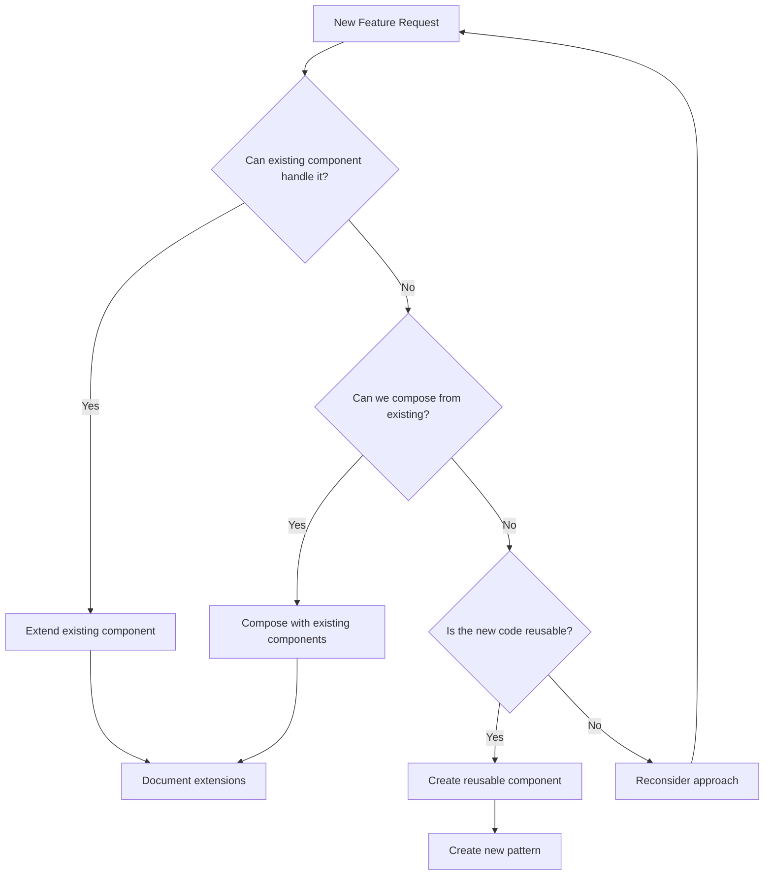

# SuperClaude Enhanced Configuration

**This project uses SuperClaude v2.0.1** - An enhanced Claude configuration for maximum efficiency.

> **MANDATORY** – Claude must consult this document AND the SuperClaude configuration before implementing any features or making changes.

## SuperClaude Configuration

- Main config: `.superclaude/superclaude.yml`
- Core philosophy: `.superclaude/shared/superclaude-core.yml`
- Rules & standards: `.superclaude/shared/superclaude-rules.yml`
- MCP integration: `.superclaude/shared/superclaude-mcp.yml`
- Personas: `.superclaude/shared/superclaude-personas.yml`

# React/TypeScript Development Guidelines

> These guidelines work in conjunction with SuperClaude to ensure consistency with our React/TypeScript/shadcn/ui technology stack.

---

## Core Philosophy

> _The best code is no code. The second-best code is code that already exists and works._

### LEVER Framework

- **L**everage existing patterns
- **E**xtend before creating
- **V**erify through testing
- **E**liminate duplication
- **R**educe complexity

---

## 🧠 Extended Thinking Process

Follow this decision tree **before writing code**:



---

## 📋 Pre-Implementation Checklist

### Pattern Recognition (10-15 min)

```markdown
## Existing Pattern Analysis

- [ ] What similar components already exist?
- [ ] Which hooks handle related state?
- [ ] What UI patterns display similar information?
- [ ] Which utilities manage related logic?

## Code Reuse Opportunities

- [ ] Can I extend an existing component with props?
- [ ] Can I compose multiple components?
- [ ] Can I enhance an existing hook?
- [ ] Can I use conditional rendering?
```

### Design System Compliance

```markdown
## shadcn/ui Design Principles

- [ ] Typography: Using only 4 font sizes and 2 weights?
- [ ] Spacing: All values divisible by 8 or 4?
- [ ] Colors: Following 60/30/10 distribution?
- [ ] Components: Using shadcn/ui primitives?
```

---

## 🏗️ Architecture Principles

### Component Design

- Favor composition over inheritance
- Use TypeScript interfaces for all props
- Implement proper error boundaries
- Follow shadcn/ui component patterns
- Maintain single responsibility principle

### State Management

- Use React hooks (useState, useReducer, useContext)
- Leverage TanStack Query for server state
- Keep component state local when possible
- Use context for cross-component state
- Implement proper loading and error states

### TypeScript Best Practices

```typescript
// ✅ DO: Use specific types
interface ButtonProps {
  variant: "primary" | "secondary" | "ghost";
  size: "sm" | "md" | "lg";
  onClick: () => void;
}

// ❌ DON'T: Use any
const handleClick = (event: any) => {}; // Never use any
```

---

## 🎨 Design System Integration

### Typography (4 Sizes, 2 Weights)

```typescript
// Size 1: Large headings
<h1 className="text-4xl font-semibold">

// Size 2: Subheadings
<h2 className="text-2xl font-semibold">

// Size 3: Body text
<p className="text-base font-normal">

// Size 4: Small text
<span className="text-sm font-normal">
```

### 8pt Grid System

```typescript
// ✅ DO: Use multiples of 4 or 8
<div className="p-4 m-8 gap-6">

// ❌ DON'T: Use arbitrary values
<div className="p-5 m-7 gap-11"> // Bad!
```

### 60/30/10 Color Rule

- 60% Neutral (background, white/light gray)
- 30% Complementary (text, dark gray/black)
- 10% Accent (CTAs, highlights, brand color)

---

## 🚨 AUTOMATED CHECKS ARE MANDATORY

**ALL linting issues are BLOCKING - EVERYTHING must be ✅ GREEN!**  
No errors. No warnings. Zero tolerance.

### Required Checks

```bash
npm run lint        # ESLint must pass
npm run typecheck   # TypeScript must compile
npm test           # All tests must pass
npm run build      # Build must succeed
```

---

## 🚫 Anti-Patterns to Avoid

### React Anti-Patterns

1. **Direct DOM manipulation** - Use React refs
2. **Inline functions in render** - Use useCallback
3. **Missing keys in lists** - Always provide unique keys
4. **Uncontrolled side effects** - Use useEffect properly
5. **Prop drilling** - Use context or composition

### TypeScript Anti-Patterns

1. **Using `any` type** - Always use specific types
2. **Type assertions** - Avoid `as` keyword when possible
3. **Missing return types** - Always specify function returns
4. **Ignoring errors** - Handle all error cases
5. **Weak typing** - Use strict mode always

---

## 🔄 Development Workflow

### Research → Plan → Implement

**NEVER JUMP STRAIGHT TO CODING!** Always follow:

1. **Research**: Explore existing components and patterns
2. **Plan**: Create implementation plan following design system
3. **Implement**: Execute with continuous validation

### Component Development Process

1. Define TypeScript interfaces
2. Create component structure
3. Implement with shadcn/ui primitives
4. Add proper styling (Tailwind classes)
5. Write tests
6. Document usage

### Testing Strategy

- Unit tests for utilities and hooks
- Component tests for UI components
- Integration tests for features
- E2E tests for critical paths (Playwright)

---

## 📝 Code Standards

### File Organization

```
src/
  components/       # React components
    ui/            # shadcn/ui components
    [Feature]/     # Feature-specific components
  hooks/           # Custom React hooks
  lib/             # Utilities and helpers
  types/           # TypeScript type definitions
  pages/           # Page components
```

### Component Structure

```typescript
// 1. Imports
import { useState } from 'react';
import { cn } from '@/lib/utils';

// 2. Types
interface ComponentProps {
  // Props definition
}

// 3. Component
export function Component({ prop }: ComponentProps) {
  // 4. Hooks
  const [state, setState] = useState();

  // 5. Handlers
  const handleClick = () => {};

  // 6. Render
  return <div />;
}
```

### Naming Conventions

- Components: PascalCase (`UserProfile`)
- Hooks: camelCase with 'use' prefix (`useUserData`)
- Utils: camelCase (`formatDate`)
- Types: PascalCase with suffix (`UserType`, `ButtonProps`)
- Constants: UPPER_SNAKE_CASE (`MAX_RETRIES`)

---

## 🛡️ Performance & Security

### Performance Optimization

- Use React.memo for expensive components
- Implement proper loading states
- Lazy load routes and heavy components
- Optimize images (WebP, proper sizing)
- Use proper Tailwind purging

### Security Best Practices

- Sanitize user inputs
- Use HTTPS for all API calls
- Implement proper authentication
- Validate all form inputs
- Never expose sensitive data in code

---

## 📚 Key Technologies

### Core Stack

- **React 18**: UI library
- **TypeScript**: Type safety
- **Vite**: Build tool
- **Tailwind CSS**: Utility-first CSS
- **shadcn/ui**: Component library
- **TanStack Query**: Server state management
- **React Router**: Routing
- **Playwright**: E2E testing
- **Vitest**: Unit testing

### Key Libraries

- **react-hook-form**: Form handling
- **date-fns**: Date manipulation
- **clsx + tailwind-merge**: Class name utilities
- **Supabase**: Backend services
- **Winston**: Logging

---

## 🎯 Success Metrics

Track development success:

- Code coverage > 80%
- TypeScript strict mode enabled
- Zero ESLint warnings/errors
- All tests passing
- Lighthouse score > 90
- Bundle size optimized

---

## 📖 References

- [React Documentation](https://react.dev)
- [TypeScript Handbook](https://www.typescriptlang.org/docs/)
- [shadcn/ui Documentation](https://ui.shadcn.com)
- [Tailwind CSS Documentation](https://tailwindcss.com/docs)
- [Design System Guidelines](./.claude/DESIGN-SYSTEM.md)
- [Component Patterns](./src/components/variations/)

---
---
description: Systematic approach for continuously improving AI assistant rules based on emerging patterns and best practices
globs: ""
alwaysApply: false
---

# Continuous Improvement Guide for AI Development Rules

This guide provides a systematic approach for continuously improving AI assistant rules based on emerging patterns, best practices, and lessons learned during development.

## Rule Improvement Triggers

### When to Create or Update Rules

**Create New Rules When:**
- A new technology/pattern is used in 3+ files
- Common bugs could be prevented by a rule
- Code reviews repeatedly mention the same feedback  
- New security or performance patterns emerge
- A complex task requires consistent approach

**Update Existing Rules When:**
- Better examples exist in the codebase
- Additional edge cases are discovered
- Related rules have been updated
- Implementation details have changed
- User feedback indicates confusion

## Analysis Process

### 1. Pattern Recognition

Monitor your codebase for repeated patterns:

```typescript
// Example: If you see this pattern repeatedly:
const data = await prisma.user.findMany({
  select: { id: true, email: true },
  where: { status: 'ACTIVE' }
});

// Consider documenting:
// - Standard select fields
// - Common where conditions  
// - Performance optimization patterns
```

### 2. Error Pattern Analysis

Track common mistakes and their solutions:

```yaml
Common Error: "Connection timeout"
Root Cause: Missing strategic delay after service startup
Solution: Add 5-10 second delay after launching services
Rule Update: Add timing guidelines to automation rules
```

### 3. Best Practice Evolution

Document emerging best practices:

```markdown
## Before (Old Pattern)
- Direct DOM manipulation
- No error handling
- Synchronous operations

## After (New Pattern)  
- Use framework methods
- Comprehensive error handling
- Async/await with proper error boundaries
```

## Rule Quality Framework

### Structure Guidelines

Each rule should follow this structure:

```markdown
# Rule Name

## Purpose
Brief description of what this rule achieves

## When to Apply
- Specific scenarios
- Trigger conditions
- Prerequisites

## Implementation
### Basic Pattern
```code
// Minimal working example
```

### Advanced Pattern
```code
// Complex scenarios with error handling
```

## Common Pitfalls
- Known issues
- How to avoid them

## References
- Related rules: [rule-name.md]
- External docs: [link]
```

### Quality Checklist

Before publishing a rule, ensure:

- [ ] **Actionable**: Provides clear, implementable guidance
- [ ] **Specific**: Avoids vague recommendations
- [ ] **Tested**: Examples come from working code
- [ ] **Complete**: Covers common edge cases
- [ ] **Current**: References are up to date
- [ ] **Linked**: Cross-references related rules

## Continuous Improvement Workflow

### 1. Collection Phase

**Daily Development**
- Note repeated code patterns
- Document solved problems
- Track tool usage patterns

**Weekly Review**
- Analyze git commits for patterns
- Review debugging sessions
- Check error logs

### 2. Analysis Phase

**Pattern Extraction**
```python
# Pseudo-code for pattern analysis
patterns = analyze_codebase()
for pattern in patterns:
    if pattern.frequency >= 3 and not documented(pattern):
        create_rule_draft(pattern)
```

**Impact Assessment**
- How many files would benefit?
- What errors would be prevented?
- How much time would be saved?

### 3. Documentation Phase

**Rule Creation Process**
1. Draft initial rule with examples
2. Test rule on existing code
3. Get feedback from team
4. Refine and publish
5. Monitor effectiveness

### 4. Maintenance Phase

**Regular Updates**
- Monthly: Review rule usage
- Quarterly: Major updates
- Annually: Deprecation review

## Meta-Rules for Rule Management

### Rule Versioning

```yaml
rule_version: 1.2.0
last_updated: 2024-01-15
breaking_changes:
  - v1.0.0: Initial release
  - v1.1.0: Added error handling patterns
  - v1.2.0: Updated for new framework version
```

### Deprecation Process

```markdown
## DEPRECATED: Old Pattern
**Status**: Deprecated as of v2.0.0
**Migration**: See [new-pattern.md]
**Removal Date**: 2024-06-01

[Original content preserved for reference]
```

### Rule Metrics

Track rule effectiveness:

```yaml
metrics:
  usage_count: 45
  error_prevention: 12 bugs avoided
  time_saved: ~3 hours/week
  user_feedback: 4.2/5
```

## Example: Self-Improving Rule System

### Automated Rule Suggestions

```typescript
// Monitor code patterns
interface RuleSuggestion {
  pattern: string;
  frequency: number;
  files: string[];
  suggestedRule: string;
}

// Generate suggestions
function analyzeForRules(codebase: Codebase): RuleSuggestion[] {
  // Implementation
}
```

### Feedback Loop Integration

```yaml
# In your project's .cursor/rules/feedback.yaml
feedback_enabled: true
feedback_channel: "#ai-rules"
suggestion_threshold: 3
auto_create_draft: true
```

## Best Practices for Rule Evolution

### 1. Start Simple
- Begin with minimal viable rules
- Add complexity based on real needs
- Avoid over-engineering

### 2. Learn from Failures
- Document what didn't work
- Understand why it failed
- Share lessons learned

### 3. Encourage Contributions
- Make it easy to suggest improvements
- Provide templates for new rules
- Recognize contributors

### 4. Measure Impact
- Track before/after metrics
- Collect user testimonials
- Quantify time savings

## Integration with Development Workflow

### Git Hooks
```bash
#!/bin/bash
# pre-commit hook to check rule compliance
./scripts/check-rules.sh
```

### CI/CD Pipeline
```yaml
# .github/workflows/rules.yml
name: Rule Compliance Check
on: [push, pull_request]
jobs:
  check-rules:
    runs-on: ubuntu-latest
    steps:
      - uses: actions/checkout@v2
      - run: npm run check:rules
```

### IDE Integration
```json
// .vscode/settings.json
{
  "cursor.rules.autoSuggest": true,
  "cursor.rules.path": ".cursor/rules",
  "cursor.rules.checkOnSave": true
}
```

## Conclusion

Continuous improvement of AI development rules is an iterative process that requires:
- Active monitoring of development patterns
- Regular analysis and documentation
- Community feedback and collaboration
- Systematic maintenance and updates

By following this guide, teams can build a living knowledge base that evolves with their codebase and continuously improves developer productivity.
_Remember: Write code that your future self will thank you for. Clear, simple, and maintainable always wins._
