# Wesley's Ambacht Sopranos Enhancement Fullstack Architecture Document

## Introduction

This document outlines the complete fullstack architecture for Wesley's Ambacht Sopranos Enhancement, including backend systems, frontend implementation, and their integration. It serves as the single source of truth for AI-driven development, ensuring consistency across the entire technology stack.

This unified approach combines what would traditionally be separate backend and frontend architecture documents, streamlining the development process for modern fullstack applications where these concerns are increasingly intertwined.

### Starter Template or Existing Project

**Existing Project Enhancement**: This project builds upon an existing React + TypeScript + Supabase foundation. The current implementation includes:
- Basic component structure with shadcn/ui components
- Established Tailwind CSS styling framework  
- Supabase client configuration (currently with empty database schema)
- React Query for state management
- React Router for navigation

**Constraints from Existing Project**:
- Must maintain current React 18.3.1 + TypeScript 5.5.3 foundation
- Must preserve existing Supabase integration and project structure
- Must enhance rather than replace current component architecture
- Must maintain compatibility with existing development workflow

### Change Log

| Date | Version | Description | Author |
| :--- | :------ | :---------- | :----- |
| 2025-06-28 | 1.0 | Initial architecture document creation based on PRD and existing foundation | Winston (Architect) |

## High Level Architecture

### Technical Summary

Wesley's Ambacht enhancement follows a modern JAMstack architecture pattern with React frontend and Supabase Backend-as-a-Service, optimized for catering business workflows. The architecture emphasizes real-time booking capabilities through Supabase's PostgreSQL database with real-time subscriptions, enabling immediate availability checking and booking confirmation. The frontend implements a sophisticated component architecture with floating booking widgets, multi-language support, and mobile-first responsive design. Integration points include WhatsApp Business API for customer communication, PDF generation for menus, and enhanced analytics for conversion tracking. This architecture achieves the PRD goals of 40% booking conversion improvement through optimized user experience, transparent pricing display, and streamlined booking workflows.

### Platform and Infrastructure Choice

**Platform Selection Analysis**:

1. **Vercel + Supabase** (Recommended) ✅
   - **Pros**: Seamless React deployment, edge functions, automatic scaling, existing Supabase integration
   - **Cons**: Vendor lock-in, limited backend customization
   - **Cost**: Free tier for development, predictable pricing for production

2. **AWS Full Stack**
   - **Pros**: Maximum flexibility, enterprise-grade scalability
   - **Cons**: Complex setup, higher costs, requires DevOps expertise
   - **Cost**: Variable based on usage

3. **Self-hosted VPS**
   - **Pros**: Full control, cost-effective for high traffic
   - **Cons**: Requires infrastructure management, security responsibility
   - **Cost**: Fixed monthly costs

**Recommendation**: Vercel + Supabase
**Rationale**: Existing Supabase integration, rapid deployment, optimal for catering business scale, excellent developer experience, built-in performance optimization

**Platform:** Vercel + Supabase
**Key Services:** Vercel (hosting, edge functions), Supabase (database, auth, real-time, storage)
**Deployment Host and Regions:** Vercel Edge Network (global), Supabase EU-West (Netherlands proximity)

### Repository Structure

**Structure:** Enhanced Monorepo
**Monorepo Tool:** Native npm workspaces (lightweight, fits current structure)
**Package Organization:** Feature-based with shared utilities

The existing structure supports enhancement without major restructuring. New components integrate into current architecture while maintaining clear separation of concerns.

### High Level Architecture Diagram

```mermaid
graph TB
    Users[👥 Users<br/>Desktop/Mobile] --> CF[🌐 Vercel Edge Network]
    CF --> Web[⚛️ React Frontend<br/>Vite + TypeScript]
    
    Web --> SB[🔧 Supabase Backend]
    SB --> DB[(🗄️ PostgreSQL Database)]
    SB --> RT[📡 Realtime Subscriptions]
    SB --> ST[📁 Storage]
    
    Web --> WA[💬 WhatsApp Business API]
    Web --> PDF[📄 PDF Generation Service]
    Web --> GA[📊 Google Analytics 4]
    
    DB --> Tables[📋 Tables:<br/>bookings, availability_slots,<br/>quotes, service_types,<br/>testimonials, suppliers]
    
    RT --> Live[⚡ Live Availability<br/>Booking Updates]
    
    style Web fill:#e1f5fe
    style SB fill:#f3e5f5
    style DB fill:#e8f5e8
    style Users fill:#fff3e0
```



### Architectural Patterns

- **JAMstack Architecture:** Static site generation with serverless APIs - _Rationale:_ Optimal performance and scalability for content-heavy catering website with dynamic booking functionality
- **Component-Based UI:** Reusable React components with TypeScript - _Rationale:_ Maintainability and type safety across large component library, enabling consistent design system
- **Real-time Data Synchronization:** Supabase real-time subscriptions - _Rationale:_ Essential for booking availability checking and preventing double-bookings
- **State Management with React Query:** Server state synchronization and caching - _Rationale:_ Optimal for API-heavy application with frequent data fetching and real-time updates
- **Mobile-First Responsive Design:** Progressive enhancement from mobile to desktop - _Rationale:_ 60% of catering inquiries originate from mobile devices based on market research
- **Progressive Web App (PWA):** Enhanced mobile capabilities - _Rationale:_ Improves user experience for repeat customers and offline capability for booking forms

## Tech Stack

### Technology Stack Table

| Category                 | Technology        | Version     | Purpose     | Rationale      |
| :----------------------- | :---------------- | :---------- | :---------- | :------------- |
| **Frontend Language**    | TypeScript        | 5.5.3       | Type-safe frontend development | Excellent tooling, catch errors at compile time, shared types with backend |
| **Frontend Framework**   | React             | 18.3.1      | UI component framework | Existing foundation, excellent ecosystem, component reusability |
| **Build Tool**           | Vite              | 5.4.1       | Fast development and production builds | Existing setup, fast HMR, optimized bundling |
| **UI Component Library** | shadcn/ui         | Latest      | Accessible, customizable components | Existing foundation, Radix UI base, Tailwind integration |
| **CSS Framework**        | Tailwind CSS      | 3.4.11      | Utility-first styling | Existing setup, rapid development, consistent design |
| **State Management**     | React Query       | 5.56.2      | Server state management | Existing setup, excellent caching, real-time integration |
| **Form Management**      | React Hook Form   | 7.53.0      | Form validation and state | Existing setup, excellent performance, Zod integration |
| **Validation**           | Zod               | 3.23.8      | Runtime type validation | Existing setup, TypeScript integration, comprehensive validation |
| **Routing**              | React Router      | 6.26.2      | Client-side routing | Existing setup, mature solution, good TypeScript support |
| **Backend Platform**     | Supabase          | 2.50.0      | Backend-as-a-Service | Existing integration, PostgreSQL, real-time, auth, storage |
| **Database**             | PostgreSQL        | 16.x        | Primary data store | Supabase managed, ACID compliance, JSON support, real-time |
| **API Style**            | REST + Supabase Client | 2.50.0 | Type-safe API communication | Built-in with Supabase, auto-generated types, real-time subscriptions |
| **Authentication**       | Supabase Auth     | 2.50.0      | User authentication | Integrated with backend, multiple providers, session management |
| **File Storage**         | Supabase Storage  | 2.50.0      | Image and document storage | Integrated with database, CDN, automatic optimization |
| **Real-time**            | Supabase Realtime | 2.50.0      | Live data synchronization | Built-in PostgreSQL CDC, WebSocket based, automatic reconnection |
| **Frontend Testing**     | Jest + RTL        | Latest      | Component and unit testing | React ecosystem standard, good TypeScript support |
| **E2E Testing**          | Playwright        | Latest      | End-to-end testing | Modern E2E solution, excellent debugging, cross-browser |
| **Deployment**           | Vercel            | Latest      | Frontend hosting and deployment | Excellent React support, edge functions, automatic previews |
| **Monitoring**           | Vercel Analytics  | Latest      | Performance monitoring | Integrated with hosting, Core Web Vitals, real user metrics |
| **Analytics**            | Google Analytics  | GA4         | User behavior tracking | Industry standard, enhanced e-commerce, conversion tracking |
| **External APIs**        | WhatsApp Business | Latest      | Customer communication | Direct messaging, business verification, automation |
| **PDF Generation**       | jsPDF + html2canvas | Latest   | Menu and quote PDFs | Client-side generation, no server dependency, offline capability |

## Data Models

### Booking

**Purpose:** Core entity representing catering service bookings with real-time availability tracking

**Key Attributes:**
- id: string (UUID) - Unique booking identifier
- date: Date - Event date
- time: string - Event time (HH:mm format)
- guest_count: number - Number of guests (10-500 range)
- service_type: enum - Type of catering service
- status: enum - Booking status (pending/confirmed/cancelled)
- customer_info: object - Contact and event details
- quote_amount: number - Preliminary or final quote amount
- special_requests: string - Custom requirements and notes

**TypeScript Interface:**

```typescript
interface Booking {
  id: string;
  date: Date;
  time: string;
  guest_count: number;
  service_type: ServiceType;
  status: BookingStatus;
  customer_info: CustomerInfo;
  quote_amount?: number;
  special_requests?: string;
  created_at: Date;
  updated_at: Date;
}

interface CustomerInfo {
  name: string;
  email: string;
  phone: string;
  company?: string;
  event_type: string;
  dietary_requirements?: string[];
}

enum ServiceType {
  CORPORATE = 'corporate',
  SOCIAL = 'social', 
  WEDDING = 'wedding',
  CUSTOM = 'custom'
}

enum BookingStatus {
  PENDING = 'pending',
  CONFIRMED = 'confirmed',
  CANCELLED = 'cancelled',
  COMPLETED = 'completed'
}
```

**Relationships:**
- Belongs to one service type (n:1)
- Has many quote line items (1:n)
- References availability slots (n:1)

### ServiceType

**Purpose:** Defines catering service categories with pricing and configuration options

**Key Attributes:**
- id: string - Service identifier
- name: string - Display name (Corporate Events, Weddings, etc.)
- base_price_per_person: number - Starting price in euros
- description: string - Service description
- included_items: array - What's included in base service
- add_on_options: array - Available upgrades and extras
- min_guests: number - Minimum guest count
- max_guests: number - Maximum guest count

**TypeScript Interface:**

```typescript
interface ServiceType {
  id: string;
  name: string;
  base_price_per_person: number;
  description: string;
  included_items: string[];
  add_on_options: AddOnOption[];
  min_guests: number;
  max_guests: number;
  is_active: boolean;
  display_order: number;
}

interface AddOnOption {
  id: string;
  name: string;
  price_per_person: number;
  description: string;
  category: string;
}
```

**Relationships:**
- Has many bookings (1:n)
- Has many add-on options (1:n)

### Quote

**Purpose:** Stores preliminary and final pricing calculations for customer transparency

**Key Attributes:**
- id: string - Quote identifier
- booking_id: string - Associated booking reference
- service_selections: object - Selected services and add-ons
- pricing_breakdown: object - Detailed cost calculation
- total_amount: number - Final quote total
- valid_until: Date - Quote expiration date
- is_preliminary: boolean - Whether quote is preliminary or final

**TypeScript Interface:**

```typescript
interface Quote {
  id: string;
  booking_id: string;
  service_selections: ServiceSelection[];
  pricing_breakdown: PricingBreakdown;
  total_amount: number;
  valid_until: Date;
  is_preliminary: boolean;
  notes?: string;
  created_at: Date;
}

interface ServiceSelection {
  service_type_id: string;
  guest_count: number;
  add_ons: string[];
  customizations: Record<string, any>;
}

interface PricingBreakdown {
  base_service: number;
  add_ons: number;
  service_fee: number;
  tax: number;
  discount?: number;
  total: number;
}
```

**Relationships:**
- Belongs to one booking (n:1)
- References service types and add-ons (n:n)

### Testimonial

**Purpose:** Customer reviews and social proof for trust building

**Key Attributes:**
- id: string - Testimonial identifier
- client_name: string - Customer name
- company_name: string - Company or organization
- event_type: string - Type of event catered
- rating: number - 1-5 star rating
- review_text: string - Testimonial content
- event_date: Date - When event took place
- is_featured: boolean - Display prominence
- is_approved: boolean - Moderation status

**TypeScript Interface:**

```typescript
interface Testimonial {
  id: string;
  client_name: string;
  company_name?: string;
  event_type: string;
  rating: number;
  review_text: string;
  event_date: Date;
  is_featured: boolean;
  is_approved: boolean;
  created_at: Date;
}
```

**Relationships:**
- May reference completed bookings (n:1)

## REST API Spec

The application uses Supabase's auto-generated REST API based on PostgreSQL schema. All endpoints follow RESTful conventions with automatic OpenAPI documentation generation.

**Base URL:** `https://[project-ref].supabase.co/rest/v1/`
**Authentication:** Bearer token (Supabase JWT)
**Content-Type:** `application/json`

**Key Endpoints:**

```typescript
// Booking Operations
GET    /bookings              // List bookings with filters
POST   /bookings              // Create new booking
GET    /bookings/:id          // Get booking details
PATCH  /bookings/:id          // Update booking
DELETE /bookings/:id          // Cancel booking

// Availability Checking
GET    /availability_slots    // Get available time slots
POST   /check_availability    // Check specific date/time availability

// Service Types and Pricing
GET    /service_types         // List all service types
GET    /service_types/:id     // Get service details with pricing

// Quote Generation
POST   /quotes                // Generate preliminary quote
GET    /quotes/:id            // Get quote details
PATCH  /quotes/:id            // Update quote

// Real-time Subscriptions
WS     /realtime              // WebSocket for live updates
```

**Sample Request/Response:**

```typescript
// POST /bookings
{
  "date": "2025-07-15",
  "time": "18:00",
  "guest_count": 50,
  "service_type": "corporate",
  "customer_info": {
    "name": "Jan van der Berg",
    "email": "jan@techcorp.nl", 
    "phone": "+31-20-1234567",
    "company": "TechCorp Nederland",
    "event_type": "Company Meeting"
  }
}

// Response
{
  "id": "uuid-booking-id",
  "status": "pending",
  "quote_amount": 625.00,
  "created_at": "2025-06-28T09:00:00Z"
}
```

## Components

### FloatingBookingWidget

**Responsibility:** Persistent booking access throughout site navigation with real-time availability checking

**Key Interfaces:**
- `openBookingModal()` - Opens booking flow
- `checkAvailability(date, time)` - Real-time availability checking
- `calculateQuote(selections)` - Preliminary pricing

**Dependencies:** React Query (API calls), Zustand (widget state), date-fns (date handling)

**Technology Stack:** React functional component with hooks, Tailwind for styling, Framer Motion for animations

### DateCheckerModal

**Responsibility:** Multi-step booking form with date/time selection, guest count, and service type selection

**Key Interfaces:**
- `onDateSelect(date)` - Date selection handler
- `onTimeSelect(time)` - Time slot selection
- `onGuestCountChange(count)` - Guest count updates
- `onServiceTypeSelect(type)` - Service selection

**Dependencies:** React Hook Form, Zod validation, React DayPicker, Supabase client

**Technology Stack:** Modal component with shadcn/ui base, form state management, real-time validation

### ServicePricingCards

**Responsibility:** Transparent pricing display with tiered service options and add-on selection

**Key Interfaces:**
- `onServiceSelect(serviceId)` - Service type selection
- `onTierSelect(tier)` - Pricing tier selection
- `onAddOnToggle(addOn)` - Add-on selection toggle

**Dependencies:** Service type data, pricing calculator, shopping cart state

**Technology Stack:** Grid layout components, hover animations, pricing calculation logic

### AwardsSection

**Responsibility:** Professional credibility display through awards, certifications, and statistics

**Key Interfaces:**
- `loadAwards()` - Fetch awards and certifications
- `displayStatistics()` - Show business metrics

**Dependencies:** Static data or CMS integration, image optimization

**Technology Stack:** Static content components, responsive image handling, animation on scroll

### TestimonialsCarousel

**Responsibility:** Social proof through rotating customer testimonials with company attribution

**Key Interfaces:**
- `loadTestimonials()` - Fetch approved testimonials
- `autoRotate()` - Automatic testimonial rotation
- `navigateToTestimonial(index)` - Manual navigation

**Dependencies:** Testimonial data, carousel navigation state, intersection observer

**Technology Stack:** Carousel component with touch gestures, auto-play functionality, responsive design

### SupplierShowcase

**Responsibility:** Local supplier partnerships display for quality assurance and authenticity

**Key Interfaces:**
- `loadSuppliers()` - Fetch supplier information
- `displaySupplierDetails(supplier)` - Show detailed information

**Dependencies:** Supplier data, image assets, modal or expansion states

**Technology Stack:** Card-based layout, image galleries, hover state management

### WhatsAppIntegration

**Responsibility:** Direct customer communication through WhatsApp Business API

**Key Interfaces:**
- `initializeChat()` - Open WhatsApp conversation
- `sendQuickMessage(template)` - Send predefined messages
- `handleBusinessHours()` - Manage availability display

**Dependencies:** WhatsApp Business API, business hours configuration

**Technology Stack:** External API integration, responsive chat widget, fallback handling

### MultiLanguageProvider

**Responsibility:** Content management for Dutch formal and English language support

**Key Interfaces:**
- `switchLanguage(locale)` - Language switching
- `translate(key)` - Content translation
- `getLocalizedContent(key)` - Dynamic content loading

**Dependencies:** Translation files, locale detection, localStorage persistence

**Technology Stack:** React Context API, i18n library, lazy loading for translations

### Component Diagrams

```mermaid
graph TB
    App[🏠 App Component] --> Nav[🧭 Navigation]
    App --> Router[🛣️ React Router]
    App --> Float[🎯 FloatingBookingWidget]
    App --> Lang[🌐 MultiLanguageProvider]
    
    Router --> Home[🏡 Home Page]
    Router --> Services[⚙️ Services Page]
    Router --> About[ℹ️ About Page]
    
    Home --> Hero[🎬 Hero Section]
    Home --> ServiceCards[💳 ServicePricingCards]
    Home --> Test[💬 TestimonialsCarousel]
    Home --> Awards[🏆 AwardsSection]
    Home --> Suppliers[🤝 SupplierShowcase]
    
    Float --> Modal[📝 DateCheckerModal]
    Modal --> Calendar[📅 Calendar Component]
    Modal --> TimeSlots[⏰ Time Selection]
    Modal --> GuestCount[👥 Guest Counter]
    Modal --> Quote[💰 Quote Calculator]
    
    Nav --> WhatsApp[💬 WhatsAppIntegration]
    Nav --> LangToggle[🔄 Language Toggle]
    
    style App fill:#e3f2fd
    style Float fill:#f3e5f5
    style Modal fill:#e8f5e8
```



## External APIs

### WhatsApp Business API

- **Purpose:** Direct customer communication and support
- **Documentation:** https://developers.facebook.com/docs/whatsapp/business-platform
- **Base URL(s):** `https://graph.facebook.com/v18.0/`
- **Authentication:** Bearer token with Business Account verification
- **Rate Limits:** 1000 messages per day (standard), upgradeable based on business verification

**Key Endpoints Used:**
- `POST /{phone-number-id}/messages` - Send messages to customers
- `GET /{phone-number-id}` - Get phone number information
- `POST /{phone-number-id}/register` - Register phone number

**Integration Notes:** Requires Facebook Business verification, webhook setup for incoming messages, template message approval for automated responses

### Google Analytics 4 API

- **Purpose:** Enhanced e-commerce tracking and conversion monitoring
- **Documentation:** https://developers.google.com/analytics/devguides/collection/ga4
- **Base URL(s):** `https://www.googletagmanager.com/gtag/js`
- **Authentication:** Google Analytics Measurement ID
- **Rate Limits:** No explicit limits for standard tracking

**Key Events Tracked:**
- `begin_checkout` - Booking form initiation
- `purchase` - Booking confirmation
- `view_item` - Service page views
- `add_to_cart` - Service selection

**Integration Notes:** GDPR compliance required, cookie consent management, enhanced e-commerce configuration for catering-specific metrics

## Core Workflows

### Booking Flow Workflow


### Real-time Availability Workflow


## Database Schema

```sql
-- Enable required extensions
CREATE EXTENSION IF NOT EXISTS "uuid-ossp";

-- Service Types table
CREATE TABLE service_types (
    id UUID DEFAULT uuid_generate_v4() PRIMARY KEY,
    name VARCHAR(100) NOT NULL,
    base_price_per_person DECIMAL(8,2) NOT NULL,
    description TEXT,
    included_items JSONB DEFAULT '[]'::jsonb,
    add_on_options JSONB DEFAULT '[]'::jsonb,
    min_guests INTEGER DEFAULT 10,
    max_guests INTEGER DEFAULT 500,
    is_active BOOLEAN DEFAULT true,
    display_order INTEGER DEFAULT 0,
    created_at TIMESTAMP WITH TIME ZONE DEFAULT CURRENT_TIMESTAMP,
    updated_at TIMESTAMP WITH TIME ZONE DEFAULT CURRENT_TIMESTAMP
);

-- Availability Slots table
CREATE TABLE availability_slots (
    id UUID DEFAULT uuid_generate_v4() PRIMARY KEY,
    date DATE NOT NULL,
    time_slot TIME NOT NULL,
    is_available BOOLEAN DEFAULT true,
    max_capacity INTEGER DEFAULT 500,
    notes TEXT,
    created_at TIMESTAMP WITH TIME ZONE DEFAULT CURRENT_TIMESTAMP,
    updated_at TIMESTAMP WITH TIME ZONE DEFAULT CURRENT_TIMESTAMP,
    UNIQUE(date, time_slot)
);

-- Bookings table
CREATE TABLE bookings (
    id UUID DEFAULT uuid_generate_v4() PRIMARY KEY,
    date DATE NOT NULL,
    time_slot TIME NOT NULL,
    guest_count INTEGER NOT NULL CHECK (guest_count >= 1),
    service_type_id UUID REFERENCES service_types(id),
    status VARCHAR(20) DEFAULT 'pending' CHECK (status IN ('pending', 'confirmed', 'cancelled', 'completed')),
    customer_info JSONB NOT NULL,
    special_requests TEXT,
    quote_amount DECIMAL(10,2),
    created_at TIMESTAMP WITH TIME ZONE DEFAULT CURRENT_TIMESTAMP,
    updated_at TIMESTAMP WITH TIME ZONE DEFAULT CURRENT_TIMESTAMP
);

-- Quotes table
CREATE TABLE quotes (
    id UUID DEFAULT uuid_generate_v4() PRIMARY KEY,
    booking_id UUID REFERENCES bookings(id) ON DELETE CASCADE,
    service_selections JSONB NOT NULL,
    pricing_breakdown JSONB NOT NULL,
    total_amount DECIMAL(10,2) NOT NULL,
    valid_until DATE NOT NULL,
    is_preliminary BOOLEAN DEFAULT true,
    notes TEXT,
    created_at TIMESTAMP WITH TIME ZONE DEFAULT CURRENT_TIMESTAMP
);

-- Testimonials table
CREATE TABLE testimonials (
    id UUID DEFAULT uuid_generate_v4() PRIMARY KEY,
    client_name VARCHAR(100) NOT NULL,
    company_name VARCHAR(200),
    event_type VARCHAR(100),
    rating INTEGER NOT NULL CHECK (rating >= 1 AND rating <= 5),
    review_text TEXT NOT NULL,
    event_date DATE,
    is_featured BOOLEAN DEFAULT false,
    is_approved BOOLEAN DEFAULT false,
    display_order INTEGER DEFAULT 0,
    created_at TIMESTAMP WITH TIME ZONE DEFAULT CURRENT_TIMESTAMP
);

-- Suppliers table
CREATE TABLE suppliers (
    id UUID DEFAULT uuid_generate_v4() PRIMARY KEY,
    name VARCHAR(200) NOT NULL,
    specialty VARCHAR(200),
    description TEXT,
    established_year INTEGER,
    location VARCHAR(200),
    website_url VARCHAR(500),
    image_url VARCHAR(500),
    is_featured BOOLEAN DEFAULT false,
    display_order INTEGER DEFAULT 0,
    created_at TIMESTAMP WITH TIME ZONE DEFAULT CURRENT_TIMESTAMP
);

-- Awards table
CREATE TABLE awards (
    id UUID DEFAULT uuid_generate_v4() PRIMARY KEY,
    title VARCHAR(200) NOT NULL,
    issuing_organization VARCHAR(200),
    award_year INTEGER,
    description TEXT,
    image_url VARCHAR(500),
    certificate_url VARCHAR(500),
    is_featured BOOLEAN DEFAULT false,
    display_order INTEGER DEFAULT 0,
    created_at TIMESTAMP WITH TIME ZONE DEFAULT CURRENT_TIMESTAMP
);

-- Create indexes for performance
CREATE INDEX idx_bookings_date_time ON bookings(date, time_slot);
CREATE INDEX idx_bookings_status ON bookings(status);
CREATE INDEX idx_availability_date ON availability_slots(date);
CREATE INDEX idx_testimonials_featured ON testimonials(is_featured, is_approved);
CREATE INDEX idx_suppliers_featured ON suppliers(is_featured);

-- Enable Row Level Security
ALTER TABLE service_types ENABLE ROW LEVEL SECURITY;
ALTER TABLE availability_slots ENABLE ROW LEVEL SECURITY;
ALTER TABLE bookings ENABLE ROW LEVEL SECURITY;
ALTER TABLE quotes ENABLE ROW LEVEL SECURITY;
ALTER TABLE testimonials ENABLE ROW LEVEL SECURITY;
ALTER TABLE suppliers ENABLE ROW LEVEL SECURITY;
ALTER TABLE awards ENABLE ROW LEVEL SECURITY;

-- Create policies for public read access
CREATE POLICY "Public read access" ON service_types FOR SELECT USING (is_active = true);
CREATE POLICY "Public read access" ON availability_slots FOR SELECT USING (true);
CREATE POLICY "Public read access" ON testimonials FOR SELECT USING (is_approved = true);
CREATE POLICY "Public read access" ON suppliers FOR SELECT USING (true);
CREATE POLICY "Public read access" ON awards FOR SELECT USING (true);

-- Create policies for booking operations (authenticated users)
CREATE POLICY "Users can create bookings" ON bookings FOR INSERT WITH CHECK (true);
CREATE POLICY "Users can read their bookings" ON bookings FOR SELECT USING (true);
CREATE POLICY "Users can create quotes" ON quotes FOR INSERT WITH CHECK (true);
CREATE POLICY "Users can read quotes" ON quotes FOR SELECT USING (true);

-- Create function for availability checking
CREATE OR REPLACE FUNCTION check_availability(
    check_date DATE,
    check_time TIME,
    guest_count INTEGER
) RETURNS BOOLEAN AS $$
DECLARE
    slot_available BOOLEAN;
    slot_capacity INTEGER;
    current_bookings INTEGER;
BEGIN
    -- Check if slot exists and is available
    SELECT is_available, max_capacity INTO slot_available, slot_capacity
    FROM availability_slots 
    WHERE date = check_date AND time_slot = check_time;
    
    -- If no slot exists, assume available with default capacity
    IF slot_available IS NULL THEN
        slot_available := true;
        slot_capacity := 500;
    END IF;
    
    -- If slot is marked unavailable, return false
    IF NOT slot_available THEN
        RETURN false;
    END IF;
    
    -- Check current bookings for this slot
    SELECT COALESCE(SUM(guest_count), 0) INTO current_bookings
    FROM bookings 
    WHERE date = check_date 
      AND time_slot = check_time 
      AND status IN ('confirmed', 'pending');
    
    -- Return true if capacity allows
    RETURN (current_bookings + guest_count) <= slot_capacity;
END;
$$ LANGUAGE plpgsql;

-- Create function for automatic quote calculation
CREATE OR REPLACE FUNCTION calculate_quote(
    service_type_id UUID,
    guest_count INTEGER,
    add_ons JSONB DEFAULT '[]'::jsonb
) RETURNS JSONB AS $$
DECLARE
    base_price DECIMAL(8,2);
    base_total DECIMAL(10,2);
    add_on_total DECIMAL(10,2) := 0;
    service_fee DECIMAL(10,2);
    tax DECIMAL(10,2);
    final_total DECIMAL(10,2);
    breakdown JSONB;
BEGIN
    -- Get base price per person
    SELECT base_price_per_person INTO base_price
    FROM service_types 
    WHERE id = service_type_id AND is_active = true;
    
    IF base_price IS NULL THEN
        RAISE EXCEPTION 'Invalid service type';
    END IF;
    
    -- Calculate base total
    base_total := base_price * guest_count;
    
    -- Calculate add-ons (simplified - would need more complex logic for real implementation)
    -- add_on_total := (SELECT SUM((elem->>'price')::decimal * guest_count) FROM jsonb_array_elements(add_ons) AS elem);
    
    -- Calculate service fee (5%)
    service_fee := (base_total + add_on_total) * 0.05;
    
    -- Calculate tax (21% VAT for Netherlands)
    tax := (base_total + add_on_total + service_fee) * 0.21;
    
    -- Calculate final total
    final_total := base_total + add_on_total + service_fee + tax;
    
    -- Build breakdown JSON
    breakdown := jsonb_build_object(
        'base_service', base_total,
        'add_ons', add_on_total,
        'service_fee', service_fee,
        'tax', tax,
        'total', final_total
    );
    
    RETURN breakdown;
END;
$$ LANGUAGE plpgsql;

-- Insert default service types
INSERT INTO service_types (name, base_price_per_person, description, min_guests, max_guests, display_order) VALUES
('Corporate Events', 12.50, 'Professional catering for business meetings, conferences, and corporate gatherings', 10, 200, 1),
('Social Events', 27.50, 'Casual catering for parties, celebrations, and social gatherings', 15, 150, 2),
('Weddings', 22.50, 'Elegant catering for wedding celebrations with customizable menu options', 20, 300, 3),
('Custom Services', 0.00, 'Bespoke catering solutions tailored to your specific requirements', 10, 500, 4);

-- Insert sample availability slots (next 30 days, 11 hours per day)
INSERT INTO availability_slots (date, time_slot, is_available, max_capacity)
SELECT 
    CURRENT_DATE + INTERVAL '1 day' * generate_series(0, 29) as date,
    TIME '10:00:00' + INTERVAL '1 hour' * generate_series(0, 10) as time_slot,
    true as is_available,
    500 as max_capacity;
```

## Frontend Architecture

### Component Architecture

**Component Organization:**

```text
src/
├── components/
│   ├── layout/
│   │   ├── Navigation.tsx
│   │   ├── Footer.tsx
│   │   └── FloatingBookingWidget.tsx
│   ├── sections/
│   │   ├── Hero.tsx
│   │   ├── ServicePricingCards.tsx
│   │   ├── TestimonialsCarousel.tsx
│   │   ├── AwardsSection.tsx
│   │   └── SupplierShowcase.tsx
│   ├── booking/
│   │   ├── DateCheckerModal.tsx
│   │   ├── TimeSlotSelector.tsx
│   │   ├── GuestCountInput.tsx
│   │   └── QuoteCalculator.tsx
│   ├── forms/
│   │   ├── BookingForm.tsx
│   │   ├── ContactForm.tsx
│   │   └── QuoteRequestForm.tsx
│   ├── ui/ (shadcn/ui components)
│   │   ├── button.tsx
│   │   ├── modal.tsx
│   │   ├── calendar.tsx
│   │   └── [other ui components]
│   └── integrations/
│       ├── WhatsAppWidget.tsx
│       ├── LanguageToggle.tsx
│       └── AnalyticsProvider.tsx
├── hooks/
│   ├── useBooking.ts
│   ├── useAvailability.ts
│   ├── useQuoteCalculation.ts
│   └── useLanguage.ts
├── services/
│   ├── supabase.ts
│   ├── whatsapp.ts
│   └── analytics.ts
├── types/
│   ├── booking.ts
│   ├── service.ts
│   └── database.ts
└── utils/
    ├── formatting.ts
    ├── validation.ts
    └── constants.ts
```

**Component Template:**

```typescript
import React from 'react';
import { cn } from '@/lib/utils';

interface ComponentProps {
  className?: string;
  // other props
}

export function Component({ className, ...props }: ComponentProps) {
  return (
    <div className={cn("default-styles", className)} {...props}>
      {/* component content */}
    </div>
  );
}
```

### State Management Architecture

**State Structure:**

```typescript
// Global state with Zustand
interface AppState {
  // Booking state
  currentBooking: Booking | null;
  bookingStep: number;
  isBookingModalOpen: boolean;
  
  // Language state
  currentLanguage: 'nl' | 'en';
  
  // UI state
  isLoading: boolean;
  notifications: Notification[];
}

// Server state with React Query
interface QueryKeys {
  serviceTypes: ['service-types'];
  availability: ['availability', date: string];
  bookings: ['bookings', filters?: BookingFilters];
  testimonials: ['testimonials', featured?: boolean];
  suppliers: ['suppliers'];
  awards: ['awards'];
}
```

**State Management Patterns:**
- React Query for server state and caching
- Zustand for client state and UI interactions
- React Context for theme and language preferences
- LocalStorage for user preferences persistence

### Routing Architecture

**Route Organization:**

```text
Routes:
├── / (Home)
├── /services (Service Details)
├── /about (About Wesley's Ambacht)
├── /contact (Contact Information)
├── /booking/confirmation/:id (Booking Confirmation)
└── /quote/:id (Quote Details)
```

**Protected Route Pattern:**

```typescript
function ProtectedRoute({ children }: { children: React.ReactNode }) {
  const { data: session } = useSession();
  
  if (!session) {
    return <Navigate to="/login" replace />;
  }
  
  return <>{children}</>;
}
```

### Frontend Services Layer

**API Client Setup:**

```typescript
import { createClient } from '@supabase/supabase-js';
import type { Database } from '@/types/database';

export const supabase = createClient<Database>(
  process.env.VITE_SUPABASE_URL!,
  process.env.VITE_SUPABASE_ANON_KEY!
);

// Type-safe API client
export class BookingService {
  async createBooking(booking: CreateBookingRequest): Promise<Booking> {
    const { data, error } = await supabase
      .from('bookings')
      .insert(booking)
      .select()
      .single();
      
    if (error) throw error;
    return data;
  }
  
  async checkAvailability(date: string, time: string, guestCount: number): Promise<boolean> {
    const { data, error } = await supabase
      .rpc('check_availability', {
        check_date: date,
        check_time: time,
        guest_count: guestCount
      });
      
    if (error) throw error;
    return data;
  }
}
```

**Service Example:**

```typescript
// Custom hook for booking operations
export function useBooking() {
  const queryClient = useQueryClient();
  
  const createBookingMutation = useMutation({
    mutationFn: BookingService.createBooking,
    onSuccess: () => {
      queryClient.invalidateQueries(['bookings']);
      queryClient.invalidateQueries(['availability']);
    }
  });
  
  const availabilityQuery = useQuery({
    queryKey: ['availability', date, time],
    queryFn: () => BookingService.checkAvailability(date, time, guestCount),
    enabled: !!date && !!time && !!guestCount
  });
  
  return {
    createBooking: createBookingMutation.mutate,
    isCreating: createBookingMutation.isPending,
    availability: availabilityQuery.data,
    isCheckingAvailability: availabilityQuery.isLoading
  };
}
```

## Backend Architecture

### Service Architecture

**Supabase Integration Pattern:**

The backend leverages Supabase's managed PostgreSQL with auto-generated REST APIs, real-time subscriptions, and Edge Functions for custom business logic.

```text
Supabase Services:
├── Database (PostgreSQL 16.x)
│   ├── Tables with RLS policies
│   ├── Custom functions (PL/pgSQL)
│   └── Triggers and indexes
├── Auth (JWT-based authentication)
│   ├── Email/password authentication
│   ├── Social providers (optional)
│   └── Session management
├── Storage (File storage with CDN)
│   ├── Image optimization
│   ├── PDF storage
│   └── Access policies
├── Realtime (WebSocket subscriptions)
│   ├── Table change subscriptions
│   ├── Presence tracking
│   └── Broadcast messaging
└── Edge Functions (Deno runtime)
    ├── Webhook handlers
    ├── Payment processing
    └── External API integrations
```

### Database Architecture

**Schema Design Principles:**
- Normalized structure with appropriate indexes
- Row Level Security (RLS) for data protection
- JSONB columns for flexible data structures
- Functions for complex business logic
- Triggers for audit trails and automated updates

**Data Access Layer:**

```typescript
// Type-safe database operations
export class DatabaseService {
  private supabase = createClient<Database>();
  
  async getServiceTypes(): Promise<ServiceType[]> {
    const { data, error } = await this.supabase
      .from('service_types')
      .select('*')
      .eq('is_active', true)
      .order('display_order');
      
    if (error) throw error;
    return data;
  }
  
  async subscribeToAvailability(callback: (payload: any) => void) {
    return this.supabase
      .channel('availability_changes')
      .on('postgres_changes', {
        event: '*',
        schema: 'public',
        table: 'availability_slots'
      }, callback)
      .subscribe();
  }
}
```

### Authentication and Authorization

**Auth Flow:**


**Middleware/Guards:**

```typescript
// RLS Policies handle authorization at database level
-- Example: Users can only access their own bookings
CREATE POLICY "Users can access own bookings" ON bookings 
FOR ALL USING (
  auth.uid() = (customer_info->>'user_id')::uuid 
  OR auth.jwt()->>'role' = 'admin'
);

// Frontend authentication wrapper
export function withAuth<T extends object>(Component: React.ComponentType<T>) {
  return function AuthenticatedComponent(props: T) {
    const { data: session, isLoading } = useSession();
    
    if (isLoading) return <LoadingSpinner />;
    
    return <Component {...props} session={session} />;
  };
}
```

## Unified Project Structure

```plaintext
wesley-ambacht-enhancement/
├── .github/                    # CI/CD workflows
│   └── workflows/
│       ├── ci.yml
│       ├── deploy.yml
│       └── lighthouse.yml
├── docs/                       # Documentation
│   ├── project-brief.md
│   ├── prd.md
│   ├── architecture.md
│   └── api-documentation.md
├── src/                        # Frontend application
│   ├── components/             # React components
│   │   ├── layout/             # Layout components
│   │   ├── sections/           # Page sections
│   │   ├── booking/            # Booking-specific components
│   │   ├── forms/              # Form components
│   │   ├── ui/                 # shadcn/ui components
│   │   └── integrations/       # External service integrations
│   ├── hooks/                  # Custom React hooks
│   │   ├── useBooking.ts
│   │   ├── useAvailability.ts
│   │   ├── useQuoteCalculation.ts
│   │   └── useLanguage.ts
│   ├── services/               # API service layers
│   │   ├── supabase.ts
│   │   ├── whatsapp.ts
│   │   ├── analytics.ts
│   │   └── pdf-generation.ts
│   ├── types/                  # TypeScript type definitions
│   │   ├── booking.ts
│   │   ├── service.ts
│   │   ├── database.ts
│   │   └── api.ts
│   ├── utils/                  # Utility functions
│   │   ├── formatting.ts
│   │   ├── validation.ts
│   │   ├── constants.ts
│   │   └── date-helpers.ts
│   ├── stores/                 # State management
│   │   ├── booking-store.ts
│   │   ├── ui-store.ts
│   │   └── language-store.ts
│   ├── styles/                 # Global styles and themes
│   │   ├── globals.css
│   │   ├── components.css
│   │   └── themes.css
│   ├── locales/                # Internationalization
│   │   ├── nl.json
│   │   └── en.json
│   └── integrations/           # Supabase integration
│       └── supabase/
│           ├── client.ts
│           ├── types.ts
│           └── queries.ts
├── supabase/                   # Supabase configuration
│   ├── config.toml
│   ├── migrations/             # Database migrations
│   │   └── 001_initial_schema.sql
│   ├── functions/              # Edge functions
│   │   ├── webhook-handler/
│   │   └── quote-generator/
│   └── seed.sql                # Initial data seeding
├── public/                     # Static assets
│   ├── images/
│   ├── icons/
│   └── documents/
├── tests/                      # Test files
│   ├── components/             # Component tests
│   ├── hooks/                  # Hook tests
│   ├── services/               # Service tests
│   └── e2e/                    # End-to-end tests
├── .env.example                # Environment template
├── .env.local                  # Local environment variables
├── package.json                # Dependencies and scripts
├── vite.config.ts              # Vite configuration
├── tailwind.config.ts          # Tailwind configuration
├── tsconfig.json               # TypeScript configuration
└── README.md                   # Project documentation
```

## Development Workflow

### Local Development Setup

**Prerequisites:**

```bash
# Required software
node --version    # v18.x or higher
npm --version     # v9.x or higher
git --version     # Latest stable
supabase --version # Supabase CLI
```

**Initial Setup:**

```bash
# Clone and install
git clone [repository-url]
cd wesley-ambacht-enhancement
npm install

# Set up environment
cp .env.example .env.local
# Edit .env.local with your Supabase credentials

# Initialize Supabase
supabase start
supabase db reset

# Run database migrations
supabase migration up
```

**Development Commands:**

```bash
# Start development server
npm run dev

# Start Supabase local development
supabase start

# Run type checking
npm run type-check

# Run tests
npm run test
npm run test:e2e

# Database operations
npm run db:reset
npm run db:seed
npm run db:generate-types
```

### Environment Configuration

**Required Environment Variables:**

```bash
# Frontend (.env.local)
VITE_SUPABASE_URL=your_supabase_project_url
VITE_SUPABASE_ANON_KEY=your_supabase_anon_key
VITE_WHATSAPP_BUSINESS_ID=your_whatsapp_business_id
VITE_GA_MEASUREMENT_ID=your_google_analytics_id

# Supabase (managed by platform)
DATABASE_URL=postgresql://[connection_string]
SUPABASE_SERVICE_ROLE_KEY=your_service_role_key
WHATSAPP_ACCESS_TOKEN=your_whatsapp_access_token

# Development only
VITE_SUPABASE_LOCAL_URL=http://localhost:54321
VITE_ENABLE_DEBUG_MODE=true
```

## Deployment Architecture

### Deployment Strategy

**Frontend Deployment:**
- **Platform:** Vercel
- **Build Command:** `npm run build`
- **Output Directory:** `dist/`
- **CDN/Edge:** Vercel Edge Network with automatic optimization

**Backend Deployment:**
- **Platform:** Supabase Cloud
- **Database:** Managed PostgreSQL with automatic backups
- **Deployment Method:** Git-based deployment with migrations

### CI/CD Pipeline

```yaml
name: Deploy Wesley's Ambacht
on:
  push:
    branches: [main]
  pull_request:
    branches: [main]

jobs:
  test:
    runs-on: ubuntu-latest
    steps:
      - uses: actions/checkout@v4
      - uses: actions/setup-node@v4
        with:
          node-version: '18'
          cache: 'npm'
      
      - run: npm ci
      - run: npm run type-check
      - run: npm run test
      - run: npm run build
      
      - name: Run Lighthouse CI
        uses: treosh/lighthouse-ci-action@v10
        with:
          configPath: './lighthouserc.js'

  deploy:
    needs: test
    runs-on: ubuntu-latest
    if: github.ref == 'refs/heads/main'
    steps:
      - uses: actions/checkout@v4
      
      - name: Deploy to Vercel
        uses: amondnet/vercel-action@v25
        with:
          vercel-token: ${{ secrets.VERCEL_TOKEN }}
          vercel-org-id: ${{ secrets.VERCEL_ORG_ID }}
          vercel-project-id: ${{ secrets.VERCEL_PROJECT_ID }}
          vercel-args: '--prod'
      
      - name: Deploy Database Changes
        run: |
          supabase migration up --project-ref ${{ secrets.SUPABASE_PROJECT_REF }}
```

### Environments

| Environment | Frontend URL | Backend URL | Purpose |
| :---------- | :----------- | :---------- | :------ |
| Development | http://localhost:5173 | http://localhost:54321 | Local development |
| Staging | https://staging.wesleyambacht.nl | https://staging-project.supabase.co | Pre-production testing |
| Production | https://www.wesleyambacht.nl | https://project.supabase.co | Live environment |

## Security and Performance

### Security Requirements

**Frontend Security:**
- CSP Headers: `script-src 'self' 'unsafe-inline' vercel.live; style-src 'self' 'unsafe-inline';`
- XSS Prevention: Input sanitization, React's built-in protection, dangerous HTML avoidance
- Secure Storage: JWT in httpOnly cookies, sensitive data encryption

**Backend Security:**
- Input Validation: Zod schemas for all inputs, SQL injection prevention via Supabase
- Rate Limiting: 100 requests/minute per IP, booking creation limited to 5/hour
- CORS Policy: `["https://wesleyambacht.nl", "https://staging.wesleyambacht.nl"]`

**Authentication Security:**
- Token Storage: Supabase handles JWT securely
- Session Management: Automatic refresh, secure logout
- Password Policy: 8+ characters, complexity requirements

### Performance Optimization

**Frontend Performance:**
- Bundle Size Target: <250KB initial bundle
- Loading Strategy: Route-based code splitting, lazy loading for images
- Caching Strategy: React Query caching, service worker for static assets

**Backend Performance:**
- Response Time Target: <300ms for API calls
- Database Optimization: Proper indexing, query optimization, connection pooling
- Caching Strategy: Supabase built-in caching, Redis for session data

## Testing Strategy

### Testing Pyramid

```text
        E2E Tests (Playwright)
       /                    \
    Integration Tests (React)
   /                          \
 Component Tests (Jest + RTL)  API Tests (Supabase)
```

### Test Organization

**Frontend Tests:**

```text
tests/
├── components/
│   ├── FloatingBookingWidget.test.tsx
│   ├── DateCheckerModal.test.tsx
│   └── ServicePricingCards.test.tsx
├── hooks/
│   ├── useBooking.test.ts
│   ├── useAvailability.test.ts
│   └── useQuoteCalculation.test.ts
├── services/
│   ├── supabase.test.ts
│   └── whatsapp.test.ts
└── utils/
    ├── formatting.test.ts
    └── validation.test.ts
```

**E2E Tests:**

```text
tests/e2e/
├── booking-flow.spec.ts
├── pricing-calculation.spec.ts
├── language-switching.spec.ts
└── mobile-experience.spec.ts
```

### Test Examples

**Frontend Component Test:**

```typescript
import { render, screen, fireEvent, waitFor } from '@testing-library/react';
import { QueryClient, QueryClientProvider } from '@tanstack/react-query';
import { FloatingBookingWidget } from '@/components/layout/FloatingBookingWidget';

describe('FloatingBookingWidget', () => {
  it('opens booking modal when clicked', async () => {
    const queryClient = new QueryClient();
    
    render(
      <QueryClientProvider client={queryClient}>
        <FloatingBookingWidget />
      </QueryClientProvider>
    );
    
    const button = screen.getByText('Check Your Date');
    fireEvent.click(button);
    
    await waitFor(() => {
      expect(screen.getByRole('dialog')).toBeInTheDocument();
    });
  });
});
```

**E2E Test:**

```typescript
import { test, expect } from '@playwright/test';

test('complete booking flow', async ({ page }) => {
  await page.goto('/');
  
  // Click floating booking widget
  await page.click('[data-testid="floating-booking-widget"]');
  
  // Select date
  await page.click('[data-testid="date-picker"]');
  await page.click('[data-date="2025-07-15"]');
  
  // Select time
  await page.selectOption('[data-testid="time-selector"]', '18:00');
  
  // Enter guest count
  await page.fill('[data-testid="guest-count"]', '50');
  
  // Verify pricing calculation
  await expect(page.locator('[data-testid="quote-total"]')).toContainText('€625');
  
  // Fill contact form
  await page.fill('[name="name"]', 'Jan van der Berg');
  await page.fill('[name="email"]', 'jan@techcorp.nl');
  await page.fill('[name="phone"]', '+31-20-1234567');
  
  // Submit booking
  await page.click('[data-testid="submit-booking"]');
  
  // Verify confirmation
  await expect(page.locator('[data-testid="booking-confirmation"]')).toBeVisible();
});
```

## Coding Standards

### Critical Fullstack Rules

- **Type Safety:** All data passing between frontend and backend must use shared TypeScript interfaces from types/ directory
- **Error Handling:** All API calls must use try-catch blocks with proper error state management
- **Real-time Updates:** Always subscribe to relevant Supabase realtime channels for data that changes frequently
- **Form Validation:** Use Zod schemas for both frontend validation and backend data integrity
- **Performance:** Implement React.memo for expensive components and useMemo for complex calculations
- **Accessibility:** All interactive elements must have proper ARIA labels and keyboard navigation support
- **Security:** Never expose sensitive environment variables to the client; use VITE_ prefix only for public variables

### Naming Conventions

| Element | Convention | Example |
| :------ | :--------- | :------ |
| Components | PascalCase | `FloatingBookingWidget.tsx` |
| Hooks | camelCase with 'use' | `useBooking.ts` |
| Services | camelCase with 'Service' | `bookingService.ts` |
| Types | PascalCase | `BookingRequest` |
| Database Tables | snake_case | `availability_slots` |
| API Endpoints | kebab-case | `/api/check-availability` |
| Environment Variables | SCREAMING_SNAKE_CASE | `VITE_SUPABASE_URL` |

## Error Handling Strategy

### Error Flow


### Error Response Format

```typescript
interface ApiError {
  error: {
    code: string;
    message: string;
    details?: Record<string, any>;
    timestamp: string;
    requestId: string;
  };
}

// Supabase error handling
interface SupabaseError {
  code: string;
  details: string;
  hint: string;
  message: string;
}
```

### Frontend Error Handling

```typescript
export function useErrorHandler() {
  const [error, setError] = useState<string | null>(null);
  
  const handleError = useCallback((error: unknown) => {
    if (error instanceof Error) {
      // Log to monitoring service
      console.error('Application error:', error);
      
      // Show user-friendly message
      if (error.message.includes('Failed to fetch')) {
        setError('Connection problem. Please check your internet and try again.');
      } else if (error.message.includes('availability')) {
        setError('Unable to check availability. Please try a different date.');
      } else {
        setError('Something went wrong. Please try again or contact support.');
      }
    }
  }, []);
  
  const clearError = useCallback(() => setError(null), []);
  
  return { error, handleError, clearError };
}
```

### Backend Error Handling

```sql
-- Database function with error handling
CREATE OR REPLACE FUNCTION create_booking_with_validation(
    booking_data JSONB
) RETURNS JSONB AS $$
DECLARE
    result JSONB;
    booking_id UUID;
BEGIN
    -- Validation
    IF NOT (booking_data ? 'date' AND booking_data ? 'time_slot' AND booking_data ? 'guest_count') THEN
        RETURN jsonb_build_object(
            'success', false,
            'error', jsonb_build_object(
                'code', 'VALIDATION_ERROR',
                'message', 'Missing required fields',
                'details', 'date, time_slot, and guest_count are required'
            )
        );
    END IF;
    
    -- Check availability
    IF NOT check_availability(
        (booking_data->>'date')::date,
        (booking_data->>'time_slot')::time,
        (booking_data->>'guest_count')::integer
    ) THEN
        RETURN jsonb_build_object(
            'success', false,
            'error', jsonb_build_object(
                'code', 'AVAILABILITY_ERROR',
                'message', 'Selected time slot is not available',
                'details', 'Please choose a different date or time'
            )
        );
    END IF;
    
    -- Create booking
    INSERT INTO bookings (date, time_slot, guest_count, customer_info, service_type_id)
    VALUES (
        (booking_data->>'date')::date,
        (booking_data->>'time_slot')::time,
        (booking_data->>'guest_count')::integer,
        booking_data->'customer_info',
        (booking_data->>'service_type_id')::uuid
    )
    RETURNING id INTO booking_id;
    
    RETURN jsonb_build_object(
        'success', true,
        'data', jsonb_build_object('booking_id', booking_id)
    );
    
EXCEPTION WHEN OTHERS THEN
    RETURN jsonb_build_object(
        'success', false,
        'error', jsonb_build_object(
            'code', 'INTERNAL_ERROR',
            'message', 'Unable to create booking',
            'details', SQLERRM
        )
    );
END;
$$ LANGUAGE plpgsql;
```

## Monitoring and Observability

### Monitoring Stack

- **Frontend Monitoring:** Vercel Analytics + Sentry for error tracking
- **Backend Monitoring:** Supabase built-in monitoring + PostHog for user analytics
- **Error Tracking:** Sentry with custom error boundaries and user context
- **Performance Monitoring:** Core Web Vitals tracking, Lighthouse CI, real user metrics

### Key Metrics

**Frontend Metrics:**
- Core Web Vitals (LCP < 2.5s, FID < 100ms, CLS < 0.1)
- JavaScript errors and unhandled rejections
- API response times and success rates
- Booking conversion funnel metrics

**Backend Metrics:**
- Database query performance and connection count
- API endpoint response times and error rates
- Booking creation success rate and validation failures
- Real-time subscription connection health

**Business Metrics:**
- Booking conversion rate (target: 40% improvement)
- Average order value (target: €850)
- Quote-to-booking time (target: <4 hours)
- Customer satisfaction scores